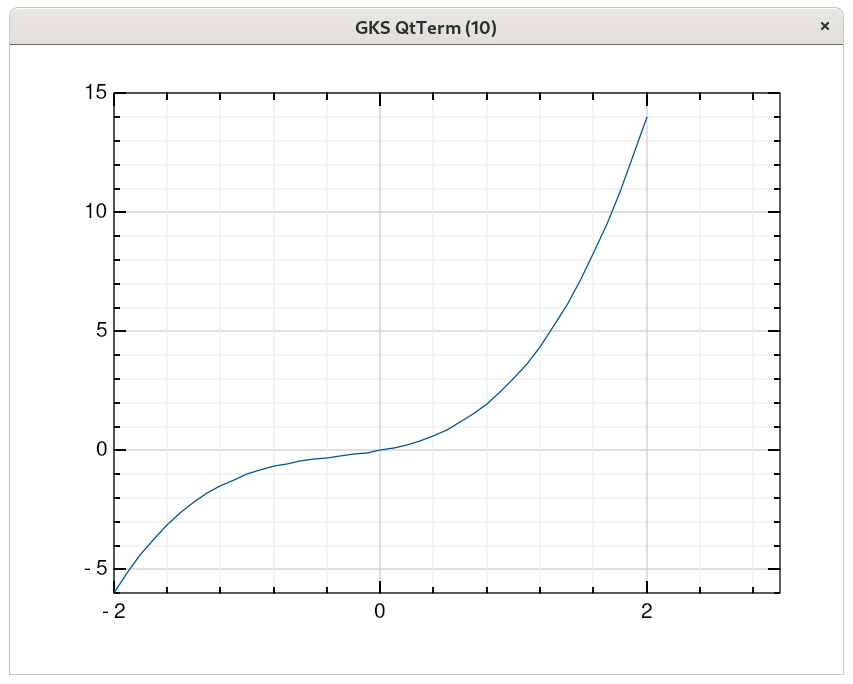

# Plot2

The following code:
```nim
import gr
import sequtils, sugar, math

let x = linRange(-2.0, 2.0, 40)
let y = x.map(x => x^3 + x^2 + x)

plot2(x,y)

discard readLine(stdin)
grm_finalize()
```

creates the following window:



!!! note

    Why `plot2`? Well I have created another `plot` function which does not depend on GRM and they share the same API.
