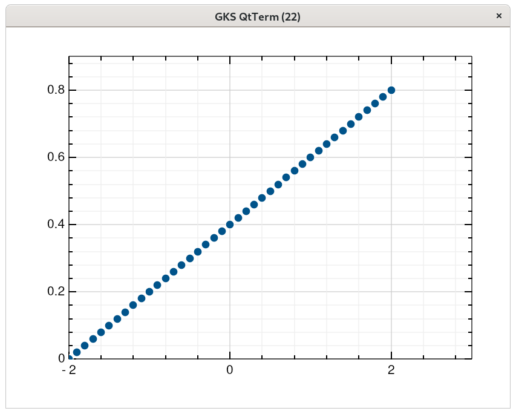

# Scatter

The following code:
```nim
import gr
import sequtils, sugar, math

let x = linRange(-2.0, 2.0, 40)
let y = x.map(x => 0.2 * x + 0.4 )     

scatter(x,y)

discard readLine(stdin)
grm_finalize()
```

creates the following window:




