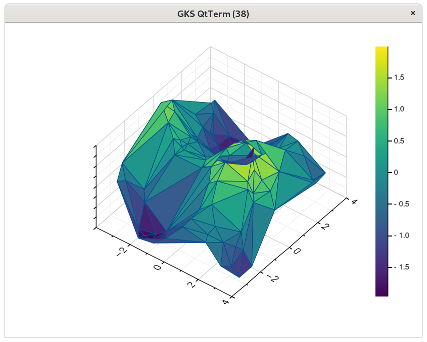

# Tri_surf

The following code:
```nim
import gr
import sequtils, sugar, math, random

let n = 100
var x = newSeq[float](n)
var y = newSeq[float](n)
var z = newSeq[float](n)
for i in 0..<n:
  x[i] = 8.0 * rand(1.0) - 4.0
  y[i] = 8.0 * rand(1.0) - 4.0
  z[i] = sin(x[i]) + cos(y[i])

trisurf(x,y,z)

discard readLine(stdin)

grm_finalize()
```

creates the following window:




